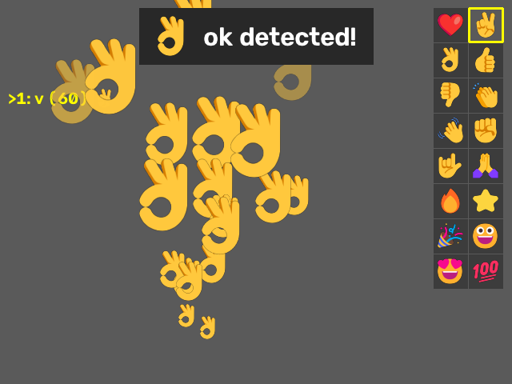

# mediapipe-hand

[MediaPipe Tasks](https://ai.google.dev/edge/mediapipe/solutions/guide) 기반 웹캠 실시간 손·얼굴 인식 예제 모음.

- **기본 데모:** Hand Landmarker / Gesture Recognizer / Face Landmarker
- **커스텀 제스처:** 내가 원하는 손 모양을 직접 녹화 → 학습 → 실시간 인식
- **🌐 웹 데모:** https://steve5781-a11y.github.io/mediapipe-hand/ — 설치 없이 브라우저에서 바로 실행
- **이모지 효과:** 제스처마다 이모지를 연결 → 인식되면 화면에 표시되고 손에서 이모지가 날아감 (❤️ ✌️ 👌 …)

<p align="center"></p>

## 목차

1. [웹 데모 (GitHub Pages)](#웹-데모-github-pages)
1. [설치](#설치)
2. [기본 데모](#기본-데모)
3. [커스텀 제스처 학습](#커스텀-제스처-학습) ⭐
4. [이모지 효과](#이모지-효과)
5. [간단 버전: 학습 없이 바로 인식](#간단-버전-학습-없이-바로-인식-my_gesturepy)
6. [참고 자료](#참고-자료)
7. [문제 해결](#문제-해결)

## 웹 데모 (GitHub Pages)

**https://steve5781-a11y.github.io/mediapipe-hand/**

`카메라 시작`을 누르고 권한을 허용하면 학습한 제스처(❤️ heart, 👌 ok, ✊ rock, ✌️ v)를 인식합니다.
오른쪽 패널에 제스처 목록과 확률이 보이고, 인식되면 초록색으로 표시되며 손에서 이모지가 날아갑니다.
영상은 브라우저 안에서만 처리되고 서버로 전송되지 않습니다.

- 손 인식: MediaPipe Tasks Vision **JS** (`@mediapipe/tasks-vision@1.1.0`, Python과 같은 버전)
- 제스처 분류: Python에서 학습한 모델을 `export_web_model.py`로 `docs/gesture_model.json`에 변환해 브라우저에서 직접 계산
- 페이지 소스: [`docs/index.html`](docs/index.html) — `main` 브랜치의 `docs/` 폴더가 그대로 배포됩니다

**내 제스처로 웹 데모 바꾸기:** 수집 → 학습 후

```bash
python export_web_model.py   # docs/gesture_model.json 갱신 (PyTorch와 예측이 같은지 자동 검증)
git add docs/gesture_model.json && git commit -m "Update web model" && git push
```

푸시하고 1~2분 뒤 웹 페이지에 반영됩니다.

## 설치

```bash
git clone https://github.com/steve5781-a11y/mediapipe-hand.git
cd mediapipe-hand
pip install -U -r requirements.txt
```

| 패키지 | 용도 |
| --- | --- |
| `mediapipe` | 손·얼굴 랜드마크, 제스처 인식 |
| `opencv-python` | 웹캠 입력, 화면 표시 |
| `numpy` | 좌표 계산 |
| `torch` | 커스텀 제스처 분류 모델 학습/추론 |
| `Pillow` | 이모지 그리기 (`cv2.putText`는 이모지를 못 그림) |

테스트 환경: Windows 11, Python 3.14, mediapipe 1.1.0, OpenCV 5.0, PyTorch 2.14

## 기본 데모

| 파일 | 설명 |
| --- | --- |
| `hand_webcam.py` | 손 21개 랜드마크 + 연결선, 왼손/오른손(Left/Right)과 신뢰도, FPS·손 개수 표시 |
| `gesture_webcam.py` | 손 랜드마크 + 기본 제스처 이름과 점수 |
| `hand_gesture_webcam.py` | 웹캠 1대로 두 모델 동시 실행. 왼쪽: Hand Landmarker, 오른쪽: Gesture Recognizer |
| `face_webcam.py` | 얼굴 478개 랜드마크 메쉬 + 눈·눈썹·입술·홍채 윤곽, 상위 8개 표정(blendshape) 점수 막대. `m` 키로 메쉬 켜기/끄기 |
| `all_webcam.py` | 세 모델을 한 화면에 겹쳐 표시 (얼굴 메쉬 + 표정 점수, 손 랜드마크, 제스처 이름). `m` 키로 얼굴 메쉬 토글 |

```bash
python hand_webcam.py
python gesture_webcam.py
python hand_gesture_webcam.py
python face_webcam.py
python all_webcam.py
```

종료: `q` / `ESC` · 손 스크립트 공통 설정: 최대 2손, `RunningMode.VIDEO`, 거울 모드(좌우 반전), 검출/추적 신뢰도 0.5

## 커스텀 제스처 학습

기본 Gesture Recognizer는 7가지 제스처만 알아봅니다. 아래 3단계로 **내가 원하는 제스처**를 추가할 수 있습니다.

```
 1) collect_gestures.py      2) train_gestures.py       3) custom_gesture_webcam.py
 웹캠으로 손 모양 녹화   →   분류 모델 학습        →   실시간 인식 + 이모지 효과
   gesture_data.csv            gesture_model.pt
   gesture_emojis.json
```

### 1) 데이터 수집 — `collect_gestures.py`

```bash
python collect_gestures.py heart v ok none
```

실행할 때 제스처 이름(영문)을 적으면 목록에 바로 들어갑니다. 이름 없이 실행하고 창에서 `n`으로 추가해도 됩니다.

| 키 | 동작 |
| --- | --- |
| `1`~`9` | 제스처 선택 (왼쪽 위 목록에서 `>` 표시) |
| `SPACE` 또는 **REC 버튼 클릭** | **1초 대기(READY) 뒤 3초 동안 자동 녹화** — 녹화 중에는 양손을 자유롭게 쓸 수 있음 |
| `n` | 새 제스처 이름 입력 (Enter 확정, ESC 취소) — **키보드가 영문 상태여야 함** |
| **오른쪽 위 이모지 클릭** | 선택한 제스처에 이모지 연결 (노란 테두리 = 현재 연결된 이모지, 목록의 이름 옆에도 표시) |
| `d` | 선택한 제스처의 데이터 삭제 (잘못 녹화했을 때) |
| `q` / `ESC` | 종료 |

- 왼쪽 위 목록에 제스처별 저장 개수가 보이고, 녹화가 끝날 때마다 터미널에 `[heart] 녹화 끝 → 총 75개 저장`처럼 출력됩니다.
- 녹화 중 손이 안 잡히면 화면에 `NO HAND`가 뜨고 그동안은 저장되지 않습니다.
- 데이터는 `gesture_data.csv`에 저장되고, 다시 실행하면 이어서 추가됩니다.

**잘 모으는 팁**
- 제스처당 **100개 이상** (3초 녹화 2~3번), 손 각도·거리·화면 위치를 조금씩 바꿔 가며 녹화하세요.
- **`none`(평소 손 모양)** 을 꼭 같이 모으세요. 없으면 아무 손 모양이나 학습한 제스처 중 하나로 인식됩니다.
- 왼손은 좌우 반전해서 오른손처럼 처리하므로 한 손으로만 모아도 양손 모두 인식됩니다.

### 2) 학습 — `train_gestures.py`

```bash
python train_gestures.py
```

```
데이터: {'heart': 120, 'none': 150, 'rock': 130}
epoch  50  loss 0.0095  시험 정확도 100.0%
...
모델 저장: gesture_model.pt  제스처: ['heart', 'none', 'rock']
```

- 데이터의 80%로 학습하고 20%로 정확도를 확인합니다. CPU로 수십 초면 끝납니다.
- 제스처가 **2개 이상** 있어야 합니다. 제스처를 추가하거나 데이터를 더 모았으면 다시 실행하세요.

### 3) 실시간 인식 — `custom_gesture_webcam.py`

```bash
python custom_gesture_webcam.py
```

손 위에 `heart 0.98`처럼 제스처 이름과 확률이 표시됩니다. 확률이 `THRESHOLD`(기본 0.7)보다 낮으면 `?`로 표시됩니다.

화면 오른쪽 패널에는 **학습한 제스처 목록**(이모지 + 확률 막대)이 표시되고, 인식된 제스처는 **초록 배경**, 맨 아래 `Now:`에 지금 인식된 제스처가 나옵니다.

### 동작 원리

```
웹캠 프레임 → Hand Landmarker → 손 관절 21개 (x, y, z)
          → 정규화: 손목 기준 이동 · 손 크기로 나눔 · 왼손 좌우 반전   (63개 숫자)
          → MLP 분류기 (63 → 128 → 64 → 제스처 수) → 제스처 이름 + 확률
```

손의 **위치·크기와 상관없이 손 모양만** 비교하므로 적은 데이터로도 잘 학습됩니다.
(공식 학습 도구 `mediapipe-model-maker`는 TensorFlow가 필요해 Python 3.14에서 설치되지 않아 PyTorch로 직접 구현했습니다.)

## 이모지 효과

수집할 때 이모지를 연결해 둔 제스처를 `custom_gesture_webcam.py`에서 하면
**화면 위쪽에 `✌️ v detected!`처럼 인식 표시가 뜨고, 손 위에서 그 이모지가 계속 날아갑니다.**
이모지는 위로 날아가며 좌우로 흔들리고, 점점 커지다가 서서히 사라집니다.

### 새 제스처 + 이모지 추가하기 (예: 브이 ✌️, 오케이 👌)

```bash
python collect_gestures.py v ok      # 이름은 창에서 n 으로 입력해도 됨
```

1. `1`~`9`로 제스처 선택 (예: `v`)
2. 오른쪽 위 선택판에서 **✌️ 클릭** → 이름 옆에 ✌️가 붙음
3. `SPACE` 또는 REC 버튼으로 녹화 (2~3번)
4. 다른 제스처도 같은 방법으로 (예: `ok` 선택 → 👌 클릭 → 녹화)
5. `python train_gestures.py`로 다시 학습 → `python custom_gesture_webcam.py`로 확인

- 연결 정보는 `gesture_emojis.json`에 저장됩니다. 처음에는 `heart` → ❤️ 가 기본으로 연결되어 있습니다.
- 이모지를 바꾸는 것만은 다시 학습할 필요가 없습니다 (인식 스크립트만 다시 실행).
- 이모지가 없는 제스처(예: `none`)는 이름만 표시되고 효과는 없습니다.

선택판 이모지: ❤️ ✌️ 👌 👍 👎 👏 👋 ✊ 🤟 🙏 🔥 ⭐ 🎉 😀 😍 💯 — 더 넣고 싶으면 `emoji_effect.py`의 `PALETTE`에 추가하세요.

`custom_gesture_webcam.py` 상단 설정:

| 설정 | 기본값 | 설명 |
| --- | --- | --- |
| `SPAWN_PER_SEC` | `15` | 초당 생기는 이모지 수 |
| `THRESHOLD` | `0.7` | 이 확률 이상일 때만 제스처로 인정 |

이모지는 Windows 기본 컬러 이모지 폰트(`seguiemj.ttf`)로 그립니다. 폰트가 없는 환경에서는 빨간 동그라미로 대신합니다.

## 간단 버전: 학습 없이 바로 인식 (`my_gesture.py`)

수집과 인식을 한 파일에서 합니다. 녹화하자마자 바로 인식되며, 따로 학습 단계가 없습니다.

```bash
python my_gesture.py heart rock
```

- 키 조작은 `collect_gestures.py`와 같습니다 (`1`~`9`, `SPACE`/REC, `n`, `d`, `q`).
- 저장한 샘플 중 **지금 손과 가장 비슷한 것**(k-최근접 이웃)을 찾아 이름을 보여줍니다. 데이터는 `my_gestures.npz`에 저장됩니다.
- 이름 옆 숫자는 가장 비슷한 샘플과의 거리입니다. `MAX_DIST`(기본 0.5)보다 멀면 `?`로 표시됩니다.

## 참고 자료

### 모델 파일

모델 파일은 저장소에 포함되어 있습니다 (스크립트와 같은 폴더에 있어야 함).

| 파일 | 크기 | 출처 |
| --- | --- | --- |
| `hand_landmarker.task` | 7.8 MB | [Hand Landmarker](https://ai.google.dev/edge/mediapipe/solutions/vision/hand_landmarker) — [다운로드](https://storage.googleapis.com/mediapipe-models/hand_landmarker/hand_landmarker/float16/latest/hand_landmarker.task) |
| `gesture_recognizer.task` | 8.4 MB | [Gesture Recognizer](https://ai.google.dev/edge/mediapipe/solutions/vision/gesture_recognizer) — [다운로드](https://storage.googleapis.com/mediapipe-models/gesture_recognizer/gesture_recognizer/float16/latest/gesture_recognizer.task) |
| `face_landmarker.task` | 3.8 MB | [Face Landmarker](https://ai.google.dev/edge/mediapipe/solutions/vision/face_landmarker) — [다운로드](https://storage.googleapis.com/mediapipe-models/face_landmarker/face_landmarker/float16/latest/face_landmarker.task) |

직접 모은 데이터(`gesture_data.csv`, `my_gestures.npz`), 이모지 연결(`gesture_emojis.json`)과 학습 결과(`gesture_model.pt`)는 `.gitignore`로 제외되어 있습니다.

### 기본 제스처 (Gesture Recognizer)

| 이름 | 제스처 |
| --- | --- |
| `Closed_Fist` | ✊ 주먹 |
| `Open_Palm` | ✋ 손바닥 펴기 |
| `Pointing_Up` | ☝️ 검지 위로 |
| `Thumb_Up` | 👍 엄지 위로 |
| `Thumb_Down` | 👎 엄지 아래로 |
| `Victory` | ✌️ 브이 |
| `ILoveYou` | 🤟 사랑해 |
| `None` | 인식되지 않음 |

### 손 랜드마크 번호

```
0  WRIST
1  THUMB_CMC          2  THUMB_MCP          3  THUMB_IP           4  THUMB_TIP
5  INDEX_FINGER_MCP   6  INDEX_FINGER_PIP   7  INDEX_FINGER_DIP   8  INDEX_FINGER_TIP
9  MIDDLE_FINGER_MCP  10 MIDDLE_FINGER_PIP  11 MIDDLE_FINGER_DIP  12 MIDDLE_FINGER_TIP
13 RING_FINGER_MCP    14 RING_FINGER_PIP    15 RING_FINGER_DIP    16 RING_FINGER_TIP
17 PINKY_MCP          18 PINKY_PIP          19 PINKY_DIP          20 PINKY_TIP
```

## 문제 해결

- **`n`을 눌러도 이름 입력이 안 됨:** 키보드가 한글 모드면 키가 `ㅜ`로 들어갑니다. 한/영 키로 영문 전환하거나, 실행할 때 `python collect_gestures.py heart rock`처럼 이름을 넘기세요.
- **키 입력이 안 먹음:** 웹캠 창을 한 번 클릭해서 선택된 상태여야 합니다.
- **아무 손이나 특정 제스처로 인식됨:** `none` 제스처를 모아서 다시 학습하세요. 또는 `THRESHOLD`를 높이세요.
- **한글 경로:** MediaPipe는 Windows에서 한글 등 비ASCII 문자가 들어간 경로의 모델 파일을 열지 못합니다 (`RuntimeError: Unable to open file`). 그래서 모든 스크립트는 모델 파일을 바이트로 읽어 `model_asset_buffer`로 전달합니다.
- **웹캠 공유:** Windows에서는 한 프로그램만 웹캠을 쓸 수 있습니다. 스크립트를 동시에 2개 띄우지 마세요. 여러 모델을 같이 보려면 `hand_gesture_webcam.py` 또는 `all_webcam.py`를 실행하세요.
- **웹캠이 열리지 않음:** 스크립트 상단의 `CAMERA_INDEX`를 `1` 등으로 바꿔 보세요. 웹캠은 `cv2.CAP_DSHOW`(DirectShow)로 엽니다.
- **로그 경고:** 실행 시 나오는 `NORM_RECT without IMAGE_DIMENSIONS`, `Feedback manager requires ...` 메시지는 MediaPipe 내부 경고이며 동작에는 영향이 없습니다.
- **FPS:** `hand_gesture_webcam.py`, `all_webcam.py`는 프레임마다 여러 모델을 실행하므로 단일 스크립트보다 FPS가 낮습니다.
